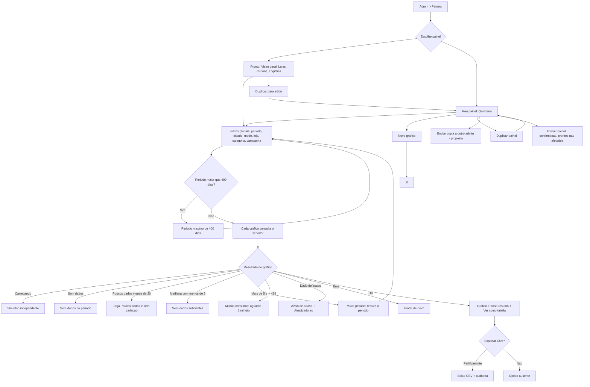
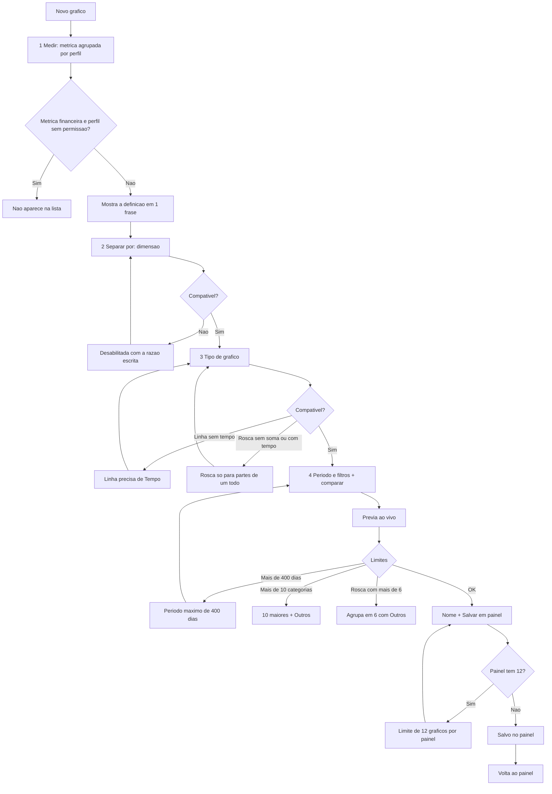

# Fluxos v1.1: painéis de gráficos e construtor

> Autor: product-designer. Data: 2026-11-22. Spec: `telas/v1-1-admin-paineis.md`.

## 1. Abrir painel pronto, filtrar, duplicar

```mermaid
flowchart TD
  A[Admin > Paineis] --> P{Escolhe painel}
  P --> PR[Pronto: Visao geral, Lojas, Cupons, Logistica]
  P --> MY[Meu painel: Quinzena]
  PR --> FL[Filtros globais: periodo, cidade, modo, loja, categoria, campanha]
  MY --> FL
  FL --> PD{Periodo maior que 400 dias?}
  PD -->|Sim| PD1[Periodo maximo de 400 dias] --> FL
  PD -->|Nao| Q[Cada grafico consulta o servidor]
  Q --> ST{Resultado do grafico}
  ST -->|Carregando| ST1[Skeleton independente]
  ST -->|Sem dados| ST2[Sem dados no periodo]
  ST -->|Poucos dados menos de 20| ST3[Tarja Poucos dados e sem variacao]
  ST -->|Mediana com menos de 5| ST4[Sem dados suficientes]
  ST -->|Mais de 5 s| ST5[Muito pesado: reduza o periodo] --> FL
  ST -->|429| ST6[Muitas consultas: aguarde 1 minuto]
  ST -->|Dado defasado| ST7[Aviso de atraso + Atualizado as]
  ST -->|Erro| ST8[Tentar de novo]
  ST -->|OK| OK[Grafico + frase-resumo + Ver como tabela]
  PR --> DUP[Duplicar para editar] --> MY
  MY --> NG[Novo grafico] --> B
  MY --> DP[Duplicar painel] --> MY
  MY --> EC[Enviar copia a outro admin - proposta] 
  MY --> DEL[Excluir painel: confirmacao, prontos nao afetados]
  OK --> EXP{Exportar CSV?}
  EXP -->|Perfil permite| EXP1[Baixa CSV + auditoria]
  EXP -->|Nao| EXP2[Opcao ausente]
```

## 2. Construtor

```mermaid
flowchart TD
  B[Novo grafico] --> M[1 Medir: metrica agrupada por perfil]
  M --> PM{Metrica financeira e perfil sem permissao?}
  PM -->|Sim| PM1[Nao aparece na lista]
  PM -->|Nao| DF[Mostra a definicao em 1 frase]
  DF --> D[2 Separar por: dimensao]
  D --> DC{Compativel?}
  DC -->|Nao| DC1[Desabilitada com a razao escrita] --> D
  DC -->|Sim| T[3 Tipo de grafico]
  T --> TC{Compativel?}
  TC -->|Linha sem tempo| TC1[Linha precisa de Tempo] --> T
  TC -->|Rosca sem soma ou com tempo| TC2[Rosca so para partes de um todo] --> T
  TC -->|Sim| F[4 Periodo e filtros + comparar]
  F --> PV[Previa ao vivo]
  PV --> LM{Limites}
  LM -->|Mais de 400 dias| LM1[Periodo maximo de 400 dias] --> F
  LM -->|Mais de 10 categorias| LM2[10 maiores + Outros]
  LM -->|Rosca com mais de 6| LM3[Agrupa em 6 com Outros]
  LM -->|OK| SV[Nome + Salvar em painel]
  SV --> PL{Painel tem 12?}
  PL -->|Sim| PL1[Limite de 12 graficos por painel] --> SV
  PL -->|Nao| DONE[Salvo no painel] --> VW[Volta ao painel]
```
